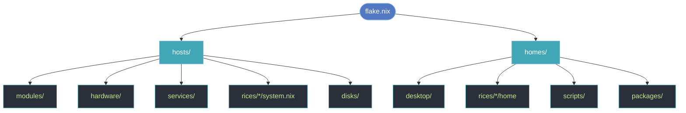

<div align="center">

```
        ╷                                   ╷         ╷    ╷
 ╭──────┴───────╮  ╭──────────────╮  ╭──────┴──────╮  ╰────┴────╮
 │   tempest ⛈  │  │   orchid 🌸  │  │   hydra 🐍  │  │ zephyr 🍃│
 │  laptop/zfs  │  │   desktop    │  │   server    │  │   pi3b+  │
 ╰──────┬───────╯  ╰──────┬───────╯  ╰──────┬──────╯  ╰────┬─────╯
        ╰─────────────────┴────────╥────────┴──────────────╯
                                   ║
                            ╔══════╩══════╗
                            ║  flake.nix  ║
                            ╚═════════════╝
```

# ❄️ source-of-truth

**One flake. Four machines. Zero snowflakes.** 🏳️‍⚧️

A personal [NixOS](https://nixos.org) monorepo wiring up a laptop, a desktop, a
server and a Pi — plus Home Manager for `irene` — from a single declarative tree.

[](https://nixos.org)
[](https://nixos.wiki/wiki/Flakes)
[](https://github.com/nix-community/home-manager)


*Impermanent root · encrypted ZFS · secure boot · scrolling WM · 3-2-1 backups*

</div>

> [!IMPORTANT]
> This tree **must** live at `/persist/source-of-truth` — the path is load-bearing.
> Several scripts and wrappers hard-code it. Don't move it without updating them.

---

## 🖥️ The fleet

| Host | What it is | Highlights |
|------|------------|------------|
| **`tempest`** ⛈️ | Framework AMD AI 300 laptop | `disko` + `impermanence` + `lanzaboote` (secure boot) + `ucodenix`, CachyOS kernel, ZFS-on-LUKS, [niri](https://github.com/YaLTeR/niri) or [mango](https://github.com/mangowm/mango), chosen at the greeter |
| **`orchid`** 🌸 | Desktop workstation | standalone Home Manager, `estradiol` rice |
| **`hydra`** 🐍 | QEMU guest server | Caddy, Grafana, Glance — the always-on box |
| **`zephyr`** 🍃 | Raspberry Pi 3B+ (aarch64) | headless; cross-built on tempest under binfmt, flashed as an SD image |
| **`tempest-vm`** 📦 | tempest, minus the hardware | same config with the physical layer dropped — disko + impermanence + niri in QEMU, via `./build-vm` |

<details>
<summary><b>What "impermanent" actually means here</b> 🫥</summary>

Tempest's `/` is a **tmpfs**. It is wiped on every boot. Anything that survives a
reboot does so because a module explicitly asked for it via `impermanence` — every
piece of state is opt-in and declared in the tree.

Consequence, and the thing to remember before touching anything on that host:
**all real data lives on `/persist`**. Sandboxes and confined services must blacklist
it explicitly; a "safe" default that only protects `$HOME` protects nothing.

</details>

---

## 🚀 Quick start

Everything is driven by [`nh`](https://github.com/nix-community/nh), enabled per host
with `programs.nh.flake` — that sets `NH_FLAKE`, so the commands work from any
directory and resolve the config by hostname / `$USER@$HOSTNAME`.

```sh
# Apply a host's NixOS config (current host)
nh os switch              # → nixos-rebuild switch, with a package diff

# Apply standalone Home Manager
nh home switch -b backup  # → homeConfigurations."irene@<host>"

# Both, in order — the daily command
apply                     # shell alias, misc/aliases.nix
```

Useful flags: `-n` dry run, `-a` ask before activating, `-u` update all flake
inputs first, `-U <input>` update one, `-d always` force the package diff.

### Housekeeping

```sh
update-home        # tempest: bump only the HM-side flake inputs
nix flake update   # bump everything (old ./update-flakes.sh wrapper removed)
nh clean all       # drop old generations + GC — system, user *and* HM profiles
                   # (runs weekly on its own via programs.nh.clean)
sitrep             # one-screen health readout (sudo for SMART)
```

> [!CAUTION]
> The disk helpers are **destructive** — they wipe and reformat the target device.
> Only run them when actually installing.
>
> ```sh
> ./tempest-format  /dev/disk/by-id/<target>   # disko destroy,format,mount
> ./tempest-install /dev/disk/by-id/<target>   # disko-install .#tempest
> # target device is a required arg (no default) — a bare run won't wipe a disk
> ```

---

## 🧭 Architecture

There is **no central "enable options" layer.** Every host's `default.nix` is a
composition root: an explicit `imports = [ … ]` list pulling from the shared trees.
Toggling a feature means editing that list — not flipping a global option.



```
flake.nix              # inputs, multi-channel overlay, nixosConfigurations + homeConfigurations
├── hosts/             # per-machine composition roots (tempest, orchid, hydra, zephyr)
├── homes/             # Home Manager configs (irene@orchid, irene@tempest)
├── modules/           # cross-cutting system modules (nix, secure-boot)
├── hardware/          # opt-in hardware (audio, bluetooth, framework, zfs, tlp)
├── services/          # à-la-carte NixOS services (borg, caddy, grafana, syncthing, vaultwarden-mirror…)
├── desktop/           # editor/terminal/app configs (helix, neovim, emacs, zed, tmux, fonts…)
├── rices/             # desktop environments — estradiol · ember (niri + mango layers)
├── packages/          # custom derivations (pkgs.callPackage)
├── scripts/           # writeScriptBin / writeShellApplication wrappers
└── disks/             # disko layouts
```

### 🌊 Multi-channel nixpkgs

The `multiChannelOverlay` exposes several channels side-by-side, so you can reach for a
different one when unstable breaks something:

| Attribute | Channel |
|-----------|---------|
| `pkgs.*` (default) | `nixos-unstable` |
| `pkgs.stable.*` | `nixos-25.11` |
| `pkgs.trunk.*` | nixpkgs trunk |
| `pkgs.custom.*` | nixpkgs trunk |

Tempest's Home Manager builds from a **separate** `nixpkgs-home` input (also tracking
unstable), so `update-home` can advance the HM channel without disturbing the system
channel. Same overlays apply to both, so `pkgs.stable.foo` resolves identically everywhere.

Other global overlays: `emacs-overlay`, `niri`, `claude-code`, `nix-cachyos-kernel`,
plus a `helix` Steel-plugin build. `allowUnfree = true`.

---

## 🔧 Homegrown bits

Things in here that aren't just "package from nixpkgs, enabled":

| | What it does |
|---|---|
| 🩺 **`sitrep`** | One-screen health readout: alerts first, then load/PSI, memory, ZFS, SMART, filesystems, backup units, failed services, network, thermals, and this boot's log errors grouped by shape. Feature-detects everything — degrades instead of failing on hosts with no ZFS or no battery. |
| 🧰 **`cage`** | bubblewrap + zellij persistent sandbox — confines a process tree in a namespace you can attach to and leave running. Spec in [`docs/cage.md`](docs/cage.md). |
| 🤖 **`claude-sandboxed`** | The same idea pointed at an agent: `/persist` blacklisted, Wayland socket forwarded so image paste still works. |
| 🔔 **`backup-notify`** | Pushes one desktop notification from a root systemd unit into the graphical session — replaced the bar's polled backup readout when Noctalia v5 dropped script polling. |
| 🎞️ **the marquee** | A permanently reserved 16:9 band on the portrait QD-OLED, derived from the monitor's mount ([ADR 0011](docs/adr/0011-marquee-on-the-portrait-oled.md)). |
| 📦 **packages/** | `drift`, `librepods`, `cider-2`, `brave-origin`, `ioskeley-mono`, `sdrplay`. |

---

## 💾 Backups (tempest)

A real **3-2-1** backup, three legs each with its own meaning of "ran" (see
[`CONTEXT.md`](./CONTEXT.md) for the full state machine):

| Leg | Where | What it buys you |
|-----|-------|------------------|
| **borg** | Hetzner storage box, daily, encrypted | the house burns down |
| **syncoid** | external USB ZFS pool, when attached | the NVMe dies |
| **sanoid** | on-NVMe snapshots | you `rm -rf`'d at 2am |

Only a leg that *ran and errored* raises the red badge. An unplugged USB drive is
a clean no-op, not a failure — the distinction is the whole design.

---

## 📓 Decisions

Anything non-obvious gets an ADR instead of a comment nobody finds. The full set
lives in [`docs/adr/`](docs/adr/):

| # | Decision |
|---|----------|
| [0001](docs/adr/0001-zfs-on-luks-tempest.md) | ZFS on LUKS for tempest |
| [0002](docs/adr/0002-external-usb-backup.md) | External USB backup pool |
| [0003](docs/adr/0003-noctalia-custom-bar-readouts.md) | Custom bar readouts in Noctalia |
| [0004](docs/adr/0004-niri-rice-as-enable-module.md) | The rice is the one enable-module *(amended by 0012)* |
| [0005](docs/adr/0005-rpi3-mainline-sd-image.md) | Mainline SD image for the Pi 3 |
| [0006](docs/adr/0006-niri-scratchpad-via-nirius.md) | Scratchpad via the nirius daemon, not a hand-rolled script |
| [0007](docs/adr/0007-niri-soft-reboot-session.md) | Soft-reboot the niri session |
| [0008](docs/adr/0008-thunderbolt-teardown-around-sleep.md) | Thunderbolt teardown around sleep |
| [0009](docs/adr/0009-oled-external-sdr-under-niri.md) | External OLED in SDR under niri |
| [0010](docs/adr/0010-tempest-opportunistic-media-automation.md) | Opportunistic media automation |
| [0011](docs/adr/0011-marquee-on-the-portrait-oled.md) | The marquee band on the portrait OLED |
| [0012](docs/adr/0012-one-rice-two-compositors.md) | One rice (ember), two compositors: niri and mango side by side |

Longer war stories — the [amdgpu 6.18.42 redraw flicker](docs/amdgpu-6.18.42-redraw-flicker.md),
[ZFS install](docs/tempest-zfs-install.md), [NVMe migration](docs/tempest-migrate-to-nvme.md) —
live alongside them in [`docs/`](docs/), as does the
[mango ↔ niri cheat-sheet](docs/mango-vs-niri.md) for tempest's two compositors.

---

## 📐 Conventions

- **Don't move the tree** — `/persist/source-of-truth` is hard-coded in several scripts.
- **Secrets** go through [`sops-nix`](https://github.com/Mic92/sops-nix). Never commit raw secrets.
- **Formatting** — 2-space indent, `alejandra`.
- **Commits** — short, lowercase summaries; one logical change; mention the host/module touched.
- **Shell** — `writeShellApplication` bodies are shellcheck-gated at build time; a warning fails the build.
- **No test framework** — validation is "does `nh os switch` evaluate and switch cleanly."

See [`AGENTS.md`](./AGENTS.md) for the author-maintained guidelines and
[`CLAUDE.md`](./CLAUDE.md) for the agent-oriented map of the repo.

---

<div align="center">

*Built with ❄️ and stubbornness. Reproducible to the bit.*

</div>
